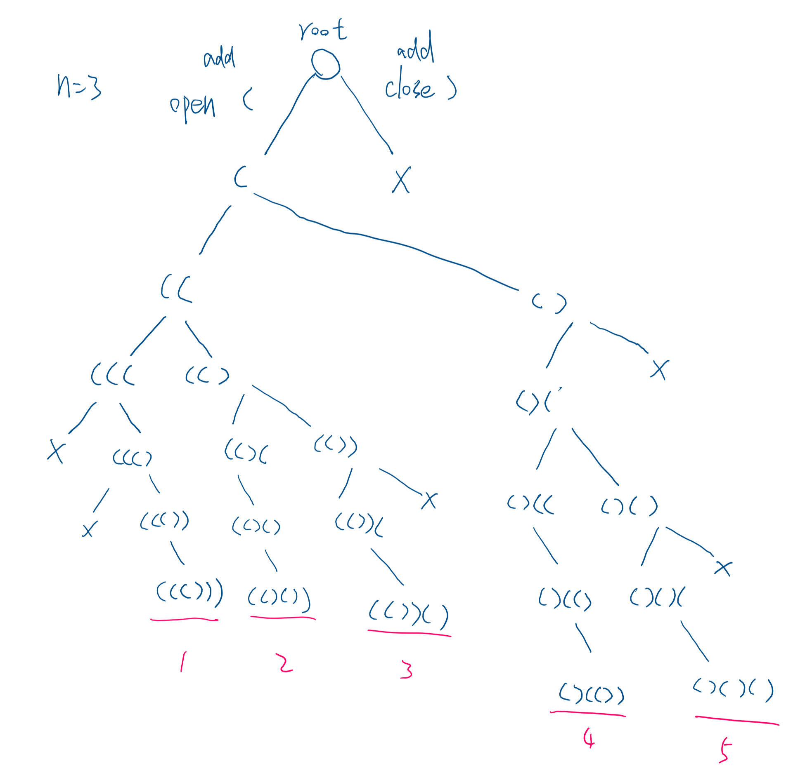

# 0022. Generate Parentheses

- tag: Backtracking, Parentheses
- URL: https://leetcode.com/problems/generate-parentheses/


## Thinking

1. We can only start from open parentheses
    1. Only valid when `open# > close#`, we can try to add the close parentheses
    2. `open# < given n`, can continue to add parentheses
2. **backtracking template:**
    
    
    ```python
    result = []
    
    def backtrack(path, options_list):
    		
        if satisfy terminal condition:
            result.add(path)
            return
    		
        for choice in options_list
            make_choice
            backtrack(path, options_list)
            unmake_choice
    ```
    

---

## Code1

- Tree:
    - left: can add (
    - right: can add )
    
    
    
- two if: help prune the binary tree
    - #of open ( will < n
    - when `#of open(  > #of closed)`, we can add “closed )”


```python
class Solution:
    def generateParenthesis(self, n: int) -> List[str]:

        stack = []
        res = []

        def backtrack(openN, closedN):
            # If satisfy terminal condition
            if openN == closedN == n:       
                res.append("".join(stack))  # all answers
                return            
            # Whether can have "("
            if openN < n:
                stack.append("(")
                backtrack(openN + 1, closedN)
                stack.pop()
            
            # Whether can have ")"
            if openN > closedN:
                stack.append(")")
                backtrack(openN, closedN + 1)
                stack.pop()
        
        backtrack(0, 0)
        return res
```

### Reference:

- [https://www.youtube.com/watch?v=s9fokUqJ76A&ab_channel=NeetCode](https://www.youtube.com/watch?v=s9fokUqJ76A&ab_channel=NeetCode)

### Complexity

- Time:
- Space: O(n)

