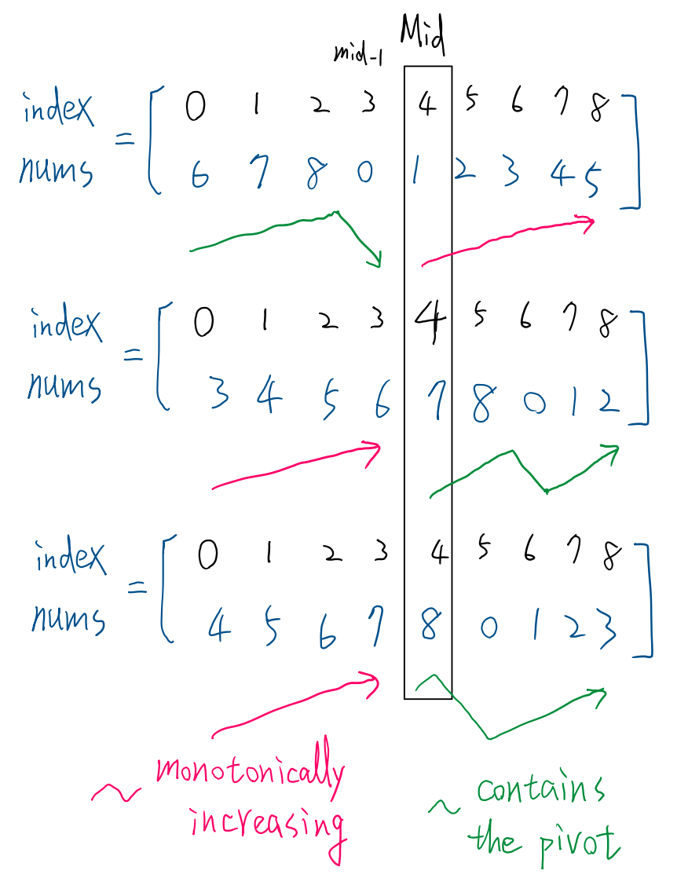

# 0033. Search in Rotated Sorted Array

- tag: `BinarySearch`
- URL: https://leetcode.com/problems/search-in-rotated-sorted-array/

## Related Questions

**0153. Find Minimum in Rotated Sorted Array**

- The array is rotated, and find the minimum element.
- In this question, the array is also rotated, and need to find the target.

## Thinking

1. To do a binary search, the array need to be sorted first. 
2. Observation of a rotated an array
    
        
    
    - The array will be divided into 2 parts:
        - sorted (monotonically increasing)
        - increasing, turning point, increasing
    - At least one half is monotonically increasing

<br>

## Code1

1. Divide into two half;
    - the half that contains the pivot
    - the sorted half (monotonically increasing)
2. Check target position
3. Binary search

```python
class Solution:
    def search(self, nums: List[int], target: int) -> int:
        
        l, r = 0, len(nums) - 1

        while l <= r:
            mid = l + (r - l) // 2
            if nums[mid] == target:
                return mid
            
            # First check if sorted, then use binary search
            if nums[l] <= nums[mid]: # monotonically increasing: left part is sorted
                if nums[l] <= target <= nums[mid]:  # target in this half
                    r = mid - 1
                else:                               # target not in this half
                    l = mid + 1
            else:
                # nums[l] > nums[mid] # right part contain turning point
                if nums[mid] <= target <= nums[r]:  # target in this half
                    l = mid + 1
                else:                               # target not in this half
                    r = mid - 1
        
        # No found
        return -1
```

### Complexity

- Time: $O(\log n)$
- Space: O(1)

<br>

## Code2  two pass binary search

- In the rotated array, the pivot = the minimum number

- 1st pass: find the index of the pivot.
    - Same as **0153. Find Minimum in Rotated Sorted Array**

    - Find `minIdx` with binary search (minimization pattern; find the 1st True)
- 2nd pass:
    - `if target <= nums[-1]:`
        - pivot is in the right-half, `the monotonically increasing half`, ⇒ Use binary search to find target
        - the boundary of the half = [minIdx,  n-1]
    - `if target > nums[-1]:`
        - target is in the left-half,  `the half that contains the pivot` , ⇒ Use binary search to find target
        - the boundary of the half = [0, minIdx]

1. step1: find the index of the pivot. pivot = the minimum  number in the rotated array
2. step2: check target position
    - the half contains pivot
    - or, the monotonically increasing half
3. step3: binary search to find the target

```python
#  Two pass of binary search
    def search(self, nums: List[int], target: int) -> int: 

        # step1
        def findMin(nums):  # Leetcode 153, here return index
            l, r = -1, len(nums)
            while l + 1 < r:
                mid = l + (r - l) // 2
                if nums[mid] <= nums[-1]:
                    r = mid
                else:
                    l = mid
            return r
        
        # Step3
        def binarySearch(nums, target, left, right):    # Find the 1st True
            l, r = left -1, right + 1
            while l + 1 < r:
                mid = l + ( r - l) // 2
                if nums[mid] >= target:     # Find 1st True that "nums[mid] >= target"
                    r = mid
                else:      
                    l = mid
            # print(f"End. l={l}, r={r}")          
            return r if nums[r] == target else -1       # return index if found else -1
     
        ###
        ans = 0
        n = len(nums)
        minIdx = findMin(nums)  # step1, find the idx of the pivot

        # step 2, check target position
        if target <= nums[-1]:  # target in right-half (monotonically increasing, include =)
            ans = binarySearch(nums, target, minIdx, n -1)  # step3
        
        else:  # target > nums[-1], target  in left-half
            ans = binarySearch(nums, target, 0, minIdx -1)  # step3

        return ans
        # Time: O(2 * logn)=O(logn), Space: O(1)
```

### Complexity

- Time: $O(2\cdot \log n)= O(\log n)$
- Space: O(1)

### Reference:

- [https://leetcode.com/discuss/study-guide/2371234/An-opinionated-guide-to-binary-search-(comprehensive-resource-with-a-bulletproof-template)#33-search-in-rotated-sorted-array](https://leetcode.com/discuss/study-guide/2371234/An-opinionated-guide-to-binary-search-(comprehensive-resource-with-a-bulletproof-template)#33-search-in-rotated-sorted-array)