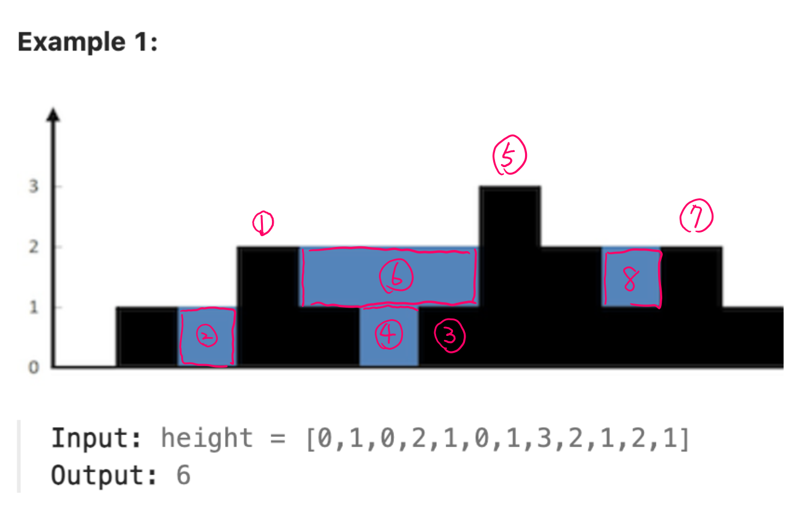

# 0042. Trapping Rain Water

- tag: MonotonicStack
- URL: https://leetcode.com/problems/trapping-rain-water/

## Related questions
- 0042: find all the trapped water
    - also, the height of the wall will affect the amount of water
- 0011: is to find the max amount of water

<br>

# Sol1: monotonic Stack

- traverse list by order
- the stack saves a tuple: (index, height)
- while `curr_h > stack[-1][1]`  ⇒ found a higher right wall
    - Every time we found a higher right wall,
    - we can compute the trapped water so far.

```python
# Sol2, Monotonic stack: the stack store (i, height)
    def trap(self, height):

        water = 0
        stack = [] # store (i, height)
        for i, curr_h in  enumerate(height):
            print(f"{i}, currH={curr_h}, {stack}:")
            # Only when foun a higher right wall (> prev_height), computed trapped water
            while stack and curr_h > stack[-1][1]:      
                pop_idx, pop_val = stack.pop()
                if not stack: 
                    break
                h = min(curr_h, stack[-1][1]) - pop_val # the smaller height
                w = i - stack[-1][0] -1
                water += h * w
                print(f"  h=min({stack[-1][1]}, {curr_h})-{pop_val} ={h},   w={i}-{stack[-1][0]}-1 ={w},  water+={h*w} =>{water}")
            
            # push current height to stack
            stack.append((i,curr_h))

        return water
```



First step: found a higher wall ( current_h > prev_h)

Second step: Can compute the trapped water: 

1. i=3, find `curr_h > stack[-1][1]` : found current_h > prev_h
2. Can compute the trapped water: 
    1. h=min(1, 2)-0 =1, w=3-1-1 =1, water+=1 =>1
3. i=6, found current_h > prev_h 
4. Can compute the trapped water
    1. h=min(1, 1)-0 =1, w=6-4-1 =1, water+=1 =>2
5. i=7, found current_h > prev_h 
6. Can compute the trapped water
    1. h=min(1, 3)-1 =0,   w=7-4-1 =2,  water+=0 =>2
    2. h=min(2, 3)-1 =1,   w=7-3-1 =3,  water+=3 =>5
7. i=10, found current_h > prev_h 
8. Can compute the trapped water
    1. h=min(2, 2)-1 =1, w=10-8-1 =1, water+=1 =>6

```python
i=0, currH=0, []:
i=1, currH=1, [(0, 0)]:
i=2, currH=0, [(1, 1)]:
i=3, currH=2, [(1, 1), (2, 0)]:
  h=min(1, 2)-0 =1,   w=3-1-1 =1,  water+=1 =>1
i=4, currH=1, [(3, 2)]:
i=5, currH=0, [(3, 2), (4, 1)]:
i=6, currH=1, [(3, 2), (4, 1), (5, 0)]:
  h=min(1, 1)-0 =1,   w=6-4-1 =1,  water+=1 =>2
i=7, currH=3, [(3, 2), (4, 1), (6, 1)]:
  h=min(1, 3)-1 =0,   w=7-4-1 =2,  water+=0 =>2
  h=min(2, 3)-1 =1,   w=7-3-1 =3,  water+=3 =>5
i=8, currH=2, [(7, 3)]:
i=9, currH=1, [(7, 3), (8, 2)]:
i=10, currH=2, [(7, 3), (8, 2), (9, 1)]:
  h=min(2, 2)-1 =1,   w=10-8-1 =1,  water+=1 =>6
i=11, currH=1, [(7, 3), (8, 2), (10, 2)]:
```

### Complexity

- Time: O(n)
- Space: O(n)

# Sol2: two pointer

- The amount of water is decided by the lower one between left & right wall
    - In each loop, compare the wall with the current height
    - water += the difference between wall & current height

```python
#####################
    # Sol3. Two pointer method
    # Time: O(n),  Space: O(1)
    # The water volume is decided by the lower height.
    def trap(self, height):

        l, r = 0, len(height)-1
        l_wall, r_wall = 0, 0
        water = 0 

        while l < r:
            if height[l] < height[r]:  # start from left wall 
                l_wall = max(l_wall, height[l]) # wall must > height
                water += l_wall - height[l]     # water = the height difference
                print(f'l={l}\t wall={l_wall}, h[l]={height[l]}, water={water}')
                l += 1
            else:   # start from right wall
                r_wall = max(r_wall, height[r])
                water += r_wall - height[r]
                print(f'r={r}\t wall={r_wall}, h[r]={height[r]}, water={water}')
                r -= 1
        return wate
```

- two pointer method use two walls from left & right boundaries until they cross

```python
height = [0,1,0,2,1,0,1,3,2,1,2,1]

l=0:  wall=0, h[l]=0, water=0
r=11:  wall=1, h[r]=1, water=0
l=1:  wall=1, h[l]=1, water=0
l=2:  wall=1, h[l]=0, water=1
r=10:  wall=2, h[r]=2, water=1
r=9:  wall=2, h[r]=1, water=2
r=8:  wall=2, h[r]=2, water=2
l=3:  wall=2, h[l]=2, water=2
l=4:  wall=2, h[l]=1, water=3
l=5:  wall=2, h[l]=0, water=5
l=6:  wall=2, h[l]=1, water=6
```

### Complexity

- Time: O(n)
- Space: O(1)