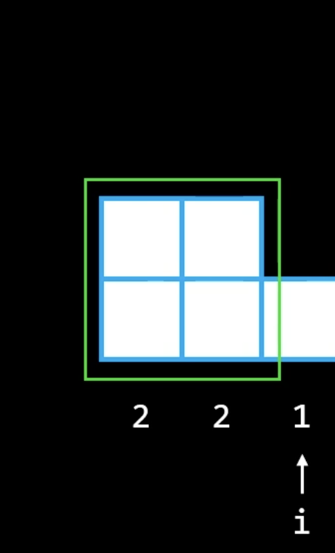

# 0084. Largest Rectangle in Histogram

- tag: MonotonicStack
- URL: https://leetcode.com/problems/largest-rectangle-in-histogram/

# Monotonic stack


- Encounter new smaller number; `current_h < previous_h` 
- => It means that  `area with previous_h` cannot grow larger anymore
    - Encouter 3， 4’s area is fixed, cannot be larger anymore
    - Encouter 2， 4’s & 3’s area is fixed, cannot be larger anymore
    - Encouter 1， 4’s, 3’s, & 2’s area is fixed, cannot be larger anymore

### monotonic increasing

- the elements in the stack are not decreasing
- encounter a smaller number, then change stack_top
- push larger number into stack

```python
nums = [5,3,1,2,4]

while curr_val < stk_top of a monotonic increasing:
		pop(stk_top) 
		push(curr_val)
else: # curr >= stk_top
		push(curr_val) 

i = 0, stk = [5]
i = 1, stk = [3] 3 < 5
i = 2, stk = [1] 1 < 3
i = 3, stk = [1, 2] 
i = 4, stk = [1, 2, 4] 
```

### monotonic decreasing

- the elements in the stack are not increasing
- push smaller number into stack

```python
nums = [5,3,1,2,4]

while curr_val > stk_top of a monotonic decreasing:
		pop(stk_top), 
		push(curr_val)
else
		push(curr_val) 

i = 0, stk = [5]
i = 1, stk = [5, 3]
i = 2, stk = [5,3,1]
i = 3, stk = [5,3,2] 
i = 4, stk = [5,4]; pop 2, pop 3, push 4 
```

<br>

# Sol1: brute force

O(n^2) ⇒ TLE in Leetcode

 
- area = w * h
    - width = the index difference = (i - j +1)
    - height = min(current_height, previous_height)
- brute force is slow due to repetitive computation
- if `heights[i] <= heights[i+1]:` area is still growing, no need to compute
- else: meet a smaller height, area become fixed, compute the area

```python
def largestRectangleArea1(self, heights: List[int]) -> int:
        
        # if len(heights) == 1:
        #     return heights[0] 
        max_area = 0
        for i in range(0, len(heights)):
            # Contine to find next larger, until meet the smaller 
            if i+1 < len(heights) and heights[i] <= heights[i+1]: 
                continue    
            h_limit = heights[i]  # the limited height 
            for j in range(i, -1, -1):
                h_limit = min(h_limit, heights[j])
                area = h_limit * (i-j+1)
                # print(f'{i}, {j}, h_limit= {h_limit}, {area} vs {max_area}')     
                max_area = max(max_area, area)
        return max_area
```

<br>


# Sol2

### Logic

- When we meet a smaller height, area stops growing. We can decide the area by the last height in the stack.
    
    
    
- height stack record `height 2` ，meet `height 1`  ⇒ pop 2, push 1
    - For a new larger height  ⇒ new `height 3`  > stack  `height 1`  ⇒ push `height 3`  to stack
        
        For a new larger height  ⇒ new `height 4`  > stack `height 3`  ⇒ push `height 4`  to stack 
        
        
        
- Meet a smaller height, can compute some areas.
    - blue： can compute area with `height 4`
    - red:     can compute area with `height 3`
    - green: area with `height 1`  is still growing

- We use a stack to record height.
    - `while curr_h ≥ stk[-1]` :  still increasing ⇒ push curr_h
    - `while curr_h < stk[-1]` : stop increasing ⇒ can compute an area
    - width = current index - (index of stk[-1]) - 1

1. Goal: find the peak value
    1. Add to stack if current value is ≥ the top of the stack
    2. if  current value ≤ the top of stack, pop height and find the max_area
2. Calculate area every time when removing stack elements
    1. if stack is empty 
        1. area = input[top] * i;   top = index saved
    2. else
        1. area = input[top] * ( i - stack top -1)
            
            
            
- **key: heights.append[0]**
    - insert 0 to ensure the stack will pop all elements when finishing

```python
def largestRectangleArea(self, heights: List[int]) -> int:
        
        heights.append(0) #!!
        max_area = 0
        stack = [-1]    # (index, retangle height)
        for i, h in enumerate(heights):
            while stack and heights[stack[-1]] > h:
                height = heights[stack.pop()]  
                idx = stack[-1]
                width = i - idx -1
                # print(f'{i}, idx={idx}, area= {height}*{width}; vs {max_area}')     
                max_area = max(max_area, height * width) 
            stack.append(i)
            # print(f'{i}, stk={stack}')
        
        # print('------------------')
        return max_area
```

Reference:

[https://www.youtube.com/watch?v=lsQTYlCiU6c&ab_channel=Knapsak](https://www.youtube.com/watch?v=lsQTYlCiU6c&ab_channel=Knapsak)

<br>

# Code3

[LARGEST RECTANGLE IN HISTOGRAM - Leetcode 84 - Python](https://www.youtube.com/watch?v=zx5Sw9130L0&ab_channel=NeetCode)

```python
def largestRectangleArea(self, heights: List[int]) -> int:

        heights.append(0) #!! Ensure pop all elements when finishing
        max_area = 0
        stack = []  # save pair (index, height)

        for i, h in enumerate(heights):
            start = i 
            # when height is not increasing, cannot extend, pop & compute area
            while stack and stack[-1][1] > h:
                idx, height = stack.pop()
                max_area = max(max_area, height * (i - idx)) # compute areas that cannot extend
                start = idx         
            stack.append((start, h))    
        
        ### Add heights.append(0), then do not need the following
        # for i, h in stack:
        #     area =  (len(heights) - i) * h
        #     max_area = max(max_area, area)
        
        return max_area
```


- when (i, h)  = (4, 2)
    - (stack[-1][1] = 6) > (h = 2), while true
        - idx, height = 3, 6
        - area = height * (i - idx) = 6 * (4-3) = 6
        - start = 3
    - (stack[-1][1] = 5) > (h = 2), while true
        - idx, height = 2, 5
        - area = height * (i - idx) = 5 * (4-2) = 10
        - start = 2  ( menas that area with `height2`  can back to index 2)
- when (i, h) = (5,3)
    - while false
    - stack.append( (start=2,h=3) )
- Last, need to clean the stack. Any value > 0, need to pop out.
    - The loop to compute max_area
    - Add `heights.append(0)` in the first line . Ensure pop all elements in the stack, then do not need the for loop